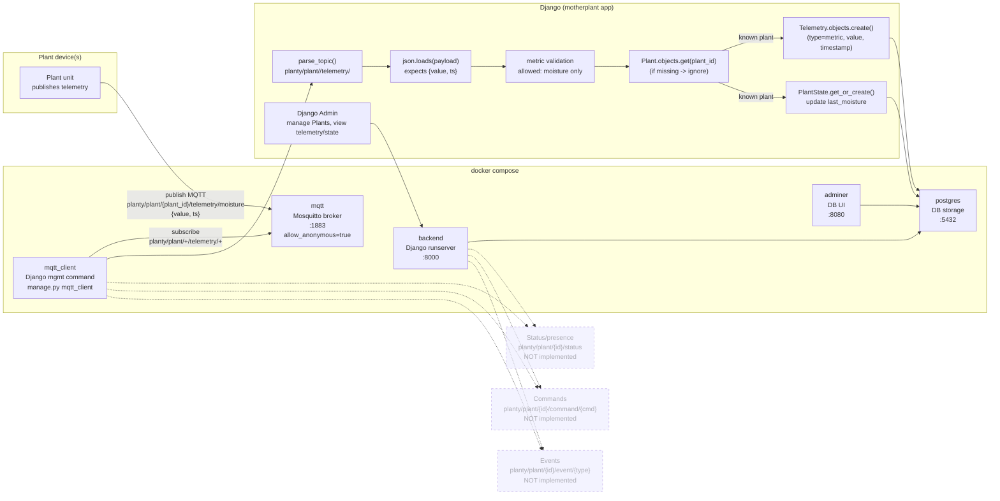

# Current Implementation Flowchart

```mermaid
flowchart LR
  %% Current situation: implemented data flow + runtime services

  subgraph Docker_Compose["docker compose"]
    MQTT["mqtt\nMosquitto broker\n:1883\nallow_anonymous=true"]
    PG["postgres\nDB storage\n:5432"]
    BACKEND["backend\nDjango runserver\n:8000"]
    WORKER["mqtt_client\nDjango mgmt command\nmanage.py mqtt_client"]
    ADMINER["adminer\nDB UI\n:8080"]
  end

  subgraph Device_Side["Plant device(s)"]
    PLANT["Plant unit\npublishes telemetry"]
  end

  subgraph Django_App["Django (motherplant app)"]
    PARSE["parse_topic()\nplanty/plant/<plant_id>/telemetry/<metric>"]
    DECODE["json.loads(payload)\nexpects {value, ts}"]
    VALIDATE["metric validation\nallowed: moisture only"]
    LOOKUP["Plant.objects.get(plant_id)\n(if missing -> ignore)"]
    STORE["Telemetry.objects.create()\n(type=metric, value, timestamp)"]
    SNAP["PlantState.get_or_create()\nupdate last_moisture"]
    ADMIN["Django Admin\nmanage Plants, view telemetry/state"]
  end

  PLANT -->|"publish MQTT\nplanty/plant/{plant_id}/telemetry/moisture\n{value, ts}"| MQTT
  WORKER -->|"subscribe\nplanty/plant/+/telemetry/+"| MQTT
  WORKER --> PARSE --> DECODE --> VALIDATE --> LOOKUP
  LOOKUP -->|"known plant"| STORE --> PG
  LOOKUP -->|"known plant"| SNAP --> PG

  BACKEND --> PG
  ADMIN --> BACKEND

  ADMINER --> PG

  %% Not implemented yet (documented only)
  STATUS["Status/presence\nplanty/plant/{id}/status\nNOT implemented"]:::missing
  CMD["Commands\nplanty/plant/{id}/command/{cmd}\nNOT implemented"]:::missing
  EVENTS["Events\nplanty/plant/{id}/event/{type}\nNOT implemented"]:::missing
  BACKEND -.-> STATUS
  BACKEND -.-> CMD
  BACKEND -.-> EVENTS
  WORKER -.-> STATUS
  WORKER -.-> CMD
  WORKER -.-> EVENTS

  classDef missing stroke-dasharray: 5 5,opacity:0.6;
```
