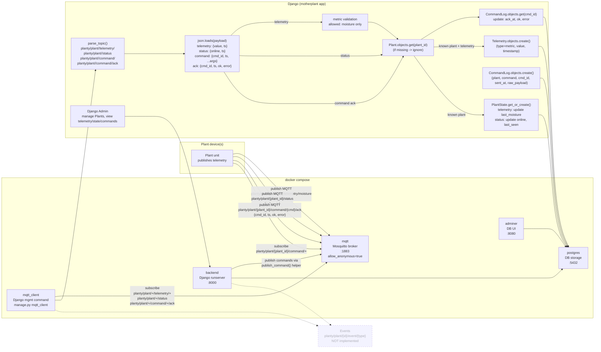

# Current Implementation Flowchart

```mermaid
flowchart LR
  %% Current situation: implemented data flow + runtime services

  subgraph Docker_Compose["docker compose"]
    MQTT["mqtt\nMosquitto broker\n:1883\nallow_anonymous=true"]
    PG["postgres\nDB storage\n:5432"]
    BACKEND["backend\nDjango runserver\n:8000"]
    WORKER["mqtt_client\nDjango mgmt command\nmanage.py mqtt_client"]
    ADMINER["adminer\nDB UI\n:8080"]
  end

  subgraph Device_Side["Plant device(s)"]
    PLANT["Plant unit\npublishes telemetry"]
  end

  subgraph Django_App["Django (motherplant app)"]
    PARSE["parse_topic()\nplanty/plant/<plant_id>/telemetry/<metric>\nplanty/plant/<plant_id>/status\nplanty/plant/<plant_id>/command/<command>\nplanty/plant/<plant_id>/command/<command>/ack"]
    DECODE["json.loads(payload)\ntelemetry: {value, ts}\nstatus: {online, ts}\ncommand: {cmd_id, ts, ...args}\nack: {cmd_id, ts, ok, error}"]
    VALIDATE["metric validation\nallowed: moisture only"]
    LOOKUP["Plant.objects.get(plant_id)\n(if missing -> ignore)"]
    STORE_TEL["Telemetry.objects.create()\n(type=metric, value, timestamp)"]
    SNAP["PlantState.get_or_create()\ntelemetry: update last_moisture\nstatus: update online, last_seen"]
    STORE_CMD["CommandLog.objects.create()\n(plant, command, cmd_id, sent_at, raw_payload)"]
    UPDATE_ACK["CommandLog.objects.get(cmd_id)\nupdate: ack_at, ok, error"]
    ADMIN["Django Admin\nmanage Plants, view telemetry/state/commands"]
  end

  PLANT -->|"publish MQTT\nplanty/plant/{plant_id}/telemetry/moisture\n{value, ts}"| MQTT
  PLANT -->|"publish MQTT\nplanty/plant/{plant_id}/status\n{online, ts}"| MQTT
  PLANT -->|"publish MQTT\nplanty/plant/{plant_id}/command/{cmd}/ack\n{cmd_id, ts, ok, error}"| MQTT
  PLANT -->|"subscribe\nplanty/plant/{plant_id}/command/+"| MQTT
  WORKER -->|"subscribe\nplanty/plant/+/telemetry/+\nplanty/plant/+/status\nplanty/plant/+/command/+/ack"| MQTT
  BACKEND -->|"publish commands via\npublish_command() helper"| MQTT
  WORKER --> PARSE --> DECODE
  DECODE -->|"telemetry"| VALIDATE --> LOOKUP
  DECODE -->|"status"| LOOKUP
  DECODE -->|"command ack"| LOOKUP --> UPDATE_ACK --> PG
  LOOKUP -->|"known plant + telemetry"| STORE_TEL --> PG
  LOOKUP -->|"known plant"| SNAP --> PG
  STORE_CMD --> PG

  BACKEND --> PG
  ADMIN --> BACKEND

  ADMINER --> PG

  %% Not implemented yet (documented only)
  EVENTS["Events\nplanty/plant/{id}/event/{type}\nNOT implemented"]:::missing
  BACKEND -.-> EVENTS
  WORKER -.-> EVENTS

  classDef missing stroke-dasharray: 5 5,opacity:0.6;
```
